# Implementation and Deployment of a Java Servlet

- **Author:** Jana Haddad
- **Course:** Applications Distribuées
- **Assignment:** Devoir 2 – Servlet

## Project Description

This repository contains a simple Java Servlet demonstration project named "hello-servlet". The application exposes a servlet that responds with a greeting message and an HTML page that links to the servlet. The project was implemented using Java 17, built with Maven, and manually deployed to Apache Tomcat 10.1.52 for evaluation.

## Technologies Used

- Java 17
- Apache Tomcat 10.1.52
- IntelliJ IDEA Ultimate
- Apache Maven
- Jakarta Servlet API 6.0.0

## Apache Tomcat Installation
I downloaded the Apache Tomcat 10.1.52 from the official website and extracted the archive to a location on my system, After extraction, I verified that the directory structure was correct:
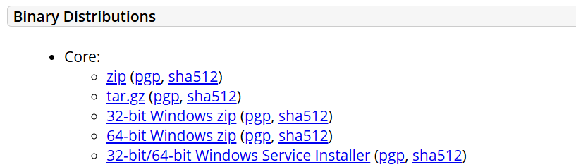
Location of Apache:
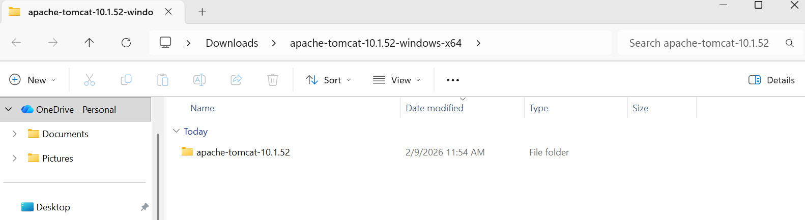
The essential folders are:
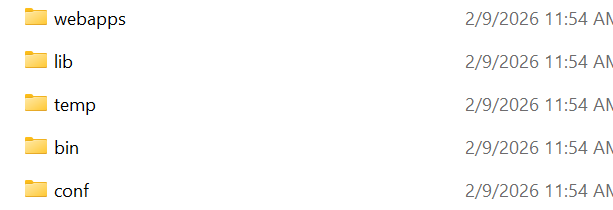
## Verifying Apache Tomcat Installation 
I navigated to the Tomcat bin directory and started Tomcat usin the startup script
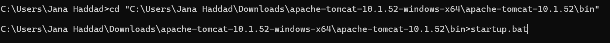
The, I opened a web browser and navigated to: 

I saw the Tomcat welcome page:
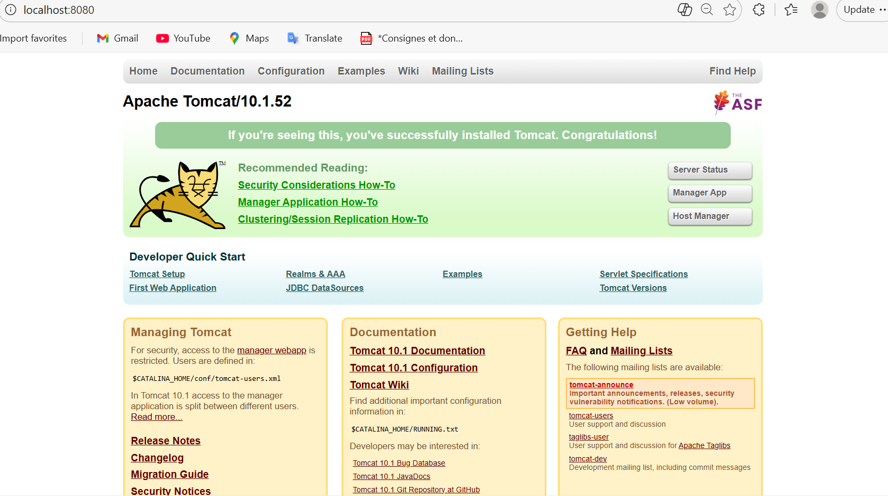


## Project Structure
I created the web application following the standard Java Web Application structure. The process was done 
step-by-step to ensure proper organization. 
```
hello-servlet/
├── pom.xml
├── src/
│   └── main/
│       ├── java/
│       │   └── com/usj/HelloServlet.java
│       ├── resources/
│       └── webapp/
│           ├── index.html
│           ├── index.jsp
│           └── WEB-INF/
│               └── web.xml
├── target/
│   └── hello-servlet.war
└── screenshots/
    ├── java-version.png
    ├── maven-build-success.png
    ├── tomcat-homepage.png
    ├── war-in-webapps.png
    ├── servlet-output.png
    └── index-html.png

```
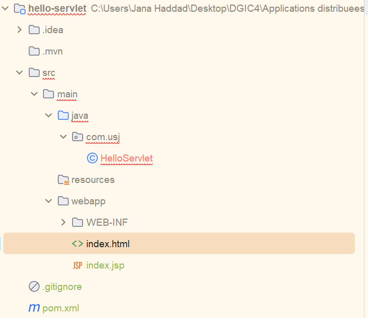
## Environment Verification

Run the following command to verify Java is available and the correct version is installed:

```
java -version
```
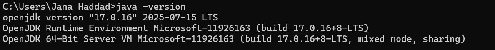

The output shows the result of running `java -version` command, displaying OpenJDK version 17.0.16 (2025-07-15 LTS) with build details for both the OpenJDK Runtime Environment and 64-Bit Server VM, confirming Java 17 is properly installed.

## Marven architecture
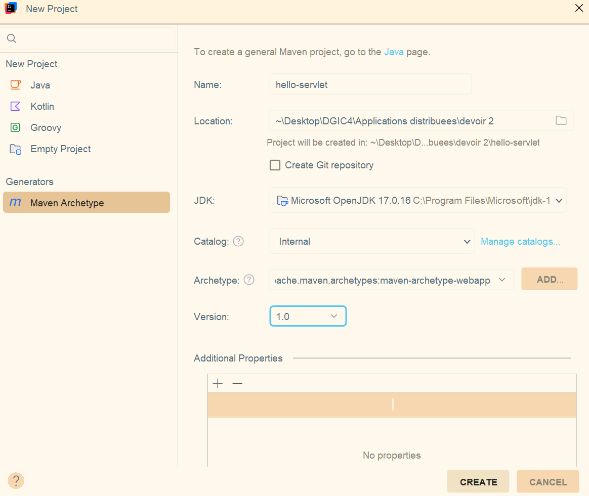
I created the pom.xml file as the deployment descriptor to configure the servlet mapping and declare the 
servlet class:
```
<project xmlns="http://maven.apache.org/POM/4.0.0" xmlns:xsi="http://www.w3.org/2001/XMLSchema-instance"
  xsi:schemaLocation="http://maven.apache.org/POM/4.0.0 http://maven.apache.org/maven-v4_0_0.xsd">
  <modelVersion>4.0.0</modelVersion>

  <groupId>com.usj</groupId>
  <artifactId>hello-servlet</artifactId>
  <packaging>war</packaging>
  <version>1.0-SNAPSHOT</version>
    <properties>
        <maven.compiler.source>17</maven.compiler.source>
        <maven.compiler.target>17</maven.compiler.target>
    </properties>

    <name>hello-servlet Maven Webapp</name>
  <url>http://maven.apache.org</url>
  <dependencies>
    <dependency>
      <groupId>jakarta.servlet</groupId>
      <artifactId>jakarta.servlet-api</artifactId>
      <version>6.0.0</version>
      <scope>provided</scope>
    </dependency>
  </dependencies>
  <build>
    <finalName>hello-servlet</finalName>
  </build>
</project>
```
I created a simple home page that serves as the entry point to the application with a link to the servlet.
index.html:
```html
<!DOCTYPE html>
<html>
<head>
    <meta charset="UTF-8">
    <title>Servlet Homework</title>
</head>
<body>
<h2>Welcome</h2>
<a href="hello">Go to Hello Servlet</a>
</body>
</html>
```
Implementing the servlet:
``` java
import jakarta.servlet.http.HttpServlet;
import jakarta.servlet.http.HttpServletRequest;
import jakarta.servlet.http.HttpServletResponse;

import java.io.IOException;
import java.io.PrintWriter;

@WebServlet("/hello")
public class HelloServlet extends HttpServlet {

    @Override
    protected void doGet(HttpServletRequest req, HttpServletResponse resp) throws IOException {
        resp.setContentType("text/html; charset=UTF-8");

        PrintWriter out = resp.getWriter();
        out.println("<h1>Hello Jana Haddad</h1>");
    }
}
```


## Build Instructions

From the project root run:

```
mvn clean
mvn package
```

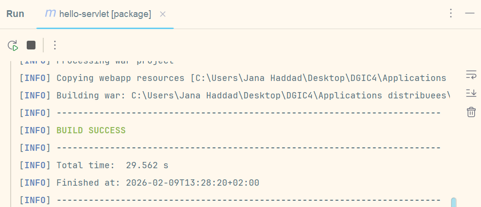
On success, a WAR file will be created at `target/hello-servlet.war`. 
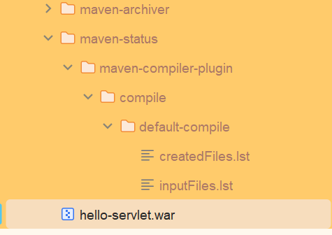

## Deployment (Manual WAR deployment)

After success, i copied the .war file in the folder webapps.


## Application Access URLs
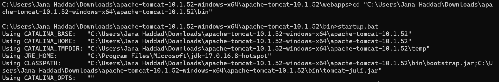
- Servlet endpoint:

  http://localhost:8080/hello-servlet/hello


Include screenshots showing the servlet output and the HTML index page:


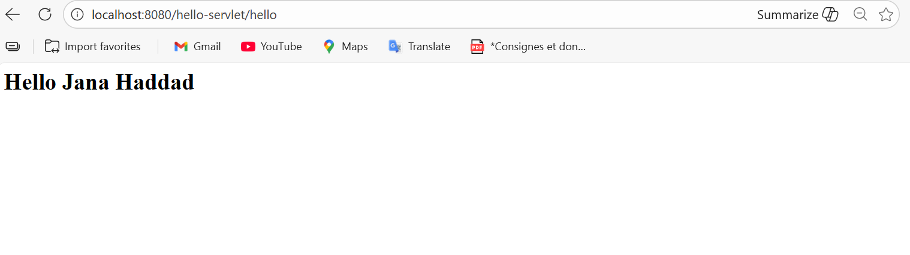


## Conclusion

This project demonstrates a minimal Java Servlet application packaged as a WAR and deployed to Apache Tomcat. The repository contains the source, deployment instructions, and placeholders for screenshots to support evaluation and submission.

